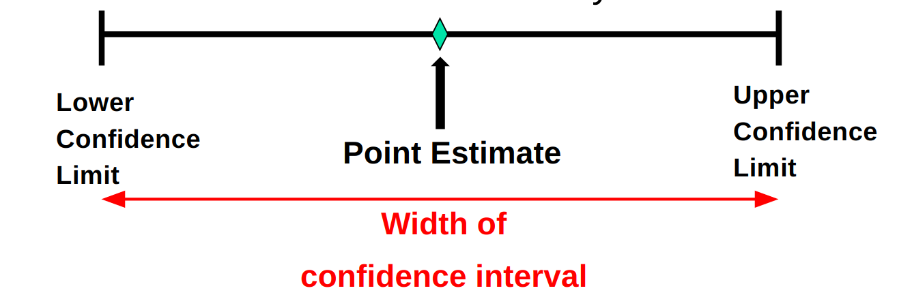

```{r setup, include=FALSE}
library(tufte)
require(dplyr)
require(tidyr)
require(ggplot2)
require(ggthemes)
require(knitr)
require(tibble)

# invalidate cache when the tufte version changes
knitr::opts_chunk$set(tidy = FALSE, cache.extra = packageVersion('tufte'))
options(htmltools.dir.version = FALSE)
```

# In this chapter, you learn: 

- To construct and interpret confidence interval estimates for the population mean and the population proportion   
- To determine the sample size necessary to develop a confidence interval for the population mean or population proportion   

# Point and Interval Estimates

- A point estimate is a single number,    
- A confidence interval provides additional information about the variability of the estimate   

  

## Point Estimate

We can estimate a population parameter: $\mu$ (population mean) or $\pi$ (population proportion) with the corresponding sample statistic: $\bar{x}$ (sample mean) or $p$ (sample proportion).  

```{r, echo=FALSE}

xh <- c("Population Parameter", "Sample Statistic Point Estimate")
x <- as.data.frame(c("$\\mu$", "$\\pi$"))
y <- as.data.frame(c("$\\bar{x}$", "$p$"))
df <- bind_cols(x,y)
colnames(df) <- xh
kable(df, caption = "Point Estimates")

```

# Confidence Intervals

- How much uncertainty is associated with a point estimate of a population parameter?  

- An *interval estimate* provides more information about a population characteristic than does a *point estimate*.  

- Such interval estimates are called **confidence intervals**.  

## Confidence Intervals Estimates  

An interval gives a range of values:  

- Takes into consideration variation in sample statistics from sample to sample  
- Based on observations from 1 sample  
- Gives information about closeness to unknown population parameters  
- Stated in terms of level of confidence  

    - e.g. 95% confident, 99% confident  
    - Can never be 100% confident  
    
## Confidence Interval Example  

Cereal fill example  

- Population has $\mu$ = 368 and $\sigma$ = 15.  
- If you take a sample of size n = 25 you know (from Chapter 7) 
```{marginfigure}
Recall from Chapter 7: 
$\mu \pm Z \times \sigma _{\bar{x}}$ and $\sigma _{\bar{x}} = \frac{\sigma}{\sqrt{n}}$
```
    - $368 \pm 1.96 \times \frac{15}{\sqrt{25}}$ = (362.12, 373.88).  95% of the intervals formed in this manner will contain $\mu$.  
    - When you don’t know µ, you use $\bar{X}$ to estimate µ.  
      - If X = 362.3 the interval is $362.3 \pm 1.96 \times \frac{15}{\sqrt{25}}$ = (356.42, 368.18)   
      - Since 356.42 $\le \mu \le$ 368.18 the interval based on this sample makes a correct statement about $\mu$.  

But what about the intervals from other possible samples of size 25?

```{r samples, echo=FALSE}

x1 <- tibble(c( 1,2,3,4,5))
x2 <- tibble(c( 362.30,369.50,360.00,362.12,373.88))
x3 <- tibble(c( 356.42,363.62,354.12,356.24,368.00))
x4 <- tibble(c( 368.18,375.38,365.88,368.00,379.76))
x5 <- tibble(c("Yes", "Yes", "No", "Yes", "Yes"))
x <- c("$\\mu$", "$\\bar{X}$")
csn1 <- paste("Contains ",x[1], "?", sep = "")
cns <- c("Sample #", x[2], "Lower Limit","Upper Limit",csn1)
df <- bind_cols(x1,x2,x3,x4,x5)
colnames(df) <- cns
kable(df)

```

- In practice you only take one sample of size n.   
- In practice you do not know µ so you do not know if the interval actually contains $\mu$.
```{marginfigure}
Note:  95% confidence is based on the fact that we used Z = 1.96.
```
- However you do know that 95% of the intervals formed in this manner may contain $\mu$.  
- Thus, based on the one sample, you actually selected you can be 95% confident your interval may contain $\mu$ (this is a 95% confidence interval)

## General Formula

The general formula for all confidence intervals is:  
Point Estimate $\pm$ (Critical Value)(Standard Error), where:

- Point Estimate is the sample statistic estimating the population parameter of interest.  
- Critical Value is a table value based on the sampling distribution of the point estimate and the desired confidence level.   
- Standard Error is the standard deviation of the point estimate.   

## Confidence Level, (1-$\alpha$)

- Suppose confidence level = 95%.   
- Also written (1 - $\alpha$) = 0.95, (so $\alpha$ = 0.05).   
- A relative frequency interpretation:  
    - 95% of all the confidence intervals that can be constructed will contain the unknown true parameter.  
- A specific interval either will contain or will not contain the true parameter.  
    - No probability involved in a specific interval.  
    
## Confidence Interval for $\mu$ ($\sigma$  Known) 

Assumptions:  

- Population standard deviation $\sigma$ is known.  
- Population is normally distributed.  
- If population is not normal, use large sample (n > 30).  
Confidence interval estimate:  

\begin{equation}
  \bar{X} \pm Z_{a/2} \frac{\sigma}{\sqrt{n}}
\end{equation}

 where:  
 
 - $\bar{X}$ is the point estimate  
- $Z_{\alpha/2}$ is the normal distribution critical value for a probability of $\alpha / 2$ in each tail  
- $\frac{\sigma}{\sqrt{n}}$ is the standard error  
		      
## Common Levels of Confidence  
  
- Commonly used confidence levels are 90%, 95%, and 99%  
```{r cl, echo=FALSE}
x1 <- tibble(c("80.0%","90,0%","95.0%","98.0%","99.0%","99.8%","99.9%"))
x2 <- tibble(c("0.800","0.900","0.950","0.980","0.990","0.998","0.999"))
x3 <- tibble(c("1.280","1.645","1.960","2.330","2.580","3.080","3.270"))
x <- c("$1-\\alpha$", "$Z _{\\alpha/2}value$")
csn1 <- paste("Confidence Coefficient ",x[1], sep = "")
cn <- c("Confidence Level", csn1, x[2])
df <- bind_cols(x1, x2, x3)
colnames(df) <- cn
# cns <- as.data.frame(c("Sample #", x[2], "Lower Limit"))
kable(df)
```

## Example   

- A sample of 11 circuits from a large normal population has a mean resistance of 2.22 ohms.  We know from past testing that the population standard deviation is 0.35 ohms.    

- Determine a 95% confidence interval for the true mean resistance of the population.  

\begin{equation}
\bar{X} \pm Z_{a/2} \frac{\sigma}{\sqrt{n}} 
= 2.22 \pm (1.96) \frac{\ .35}{\sqrt{11}}   
= 2.22 \pm 0.2068   
\end{equation}


## Interpretation

- We are 95% confident that the true mean resistance is between 2.0132  and  2.4268 ohms.  
- Although the true mean may or may not be in this interval, 95% of intervals formed in this manner may contain the true mean.  

## Do You Ever Truly Know $\sigma$?

- Probably not!  

In virtually all real world business situations, $\sigma$ is not known.  

If there is a situation where $\sigma$ is known then µ is also known (since to calculate $\sigma$ you need to know $\mu$.).  

If you truly know $\mu$ there would be no need to gather a sample to estimate it.  

# Confidence Interval for $\mu$ ($\sigma$ Unknown)

- If the population standard deviation $\sigma$ is unknown, we can substitute the sample standard deviation, $S$   
-  This introduces extra uncertainty, since  $S$  is variable from sample to sample.    
- So we use the *t distribution* instead of the normal distribution.  


- Assumptions:  
    - Population standard deviation is unknown.  
    - Population is normally distributed.   
    - If population is not normal, use large sample (n > 30).   
    
Use Student’s t  Distribution  
Confidence Interval Estimate: 

\begin{equation}
  \bar{X} \pm t_{\alpha/2} \frac{S}{\sqrt{n}} 
\end{equation}

(where $t_{\alpha/2}$ is the critical value of the t distribution with n -1 degrees of freedom and an area of $\alpha/2$ in each tail).  

## Student's t Distribution  

- The t is a family of distributions.  
- The $t_{alpha/2}$ value depends on *degrees of freedom (d.f.)*.    
- Number of observations that are free to vary after sample mean has been calculated.  
    - d.f. = n - 1

## Degrees of Freedom (df)  

Idea: Number of observations that are free to vary after sample mean has been calculated.  
Example: Suppose the mean of 3 numbers is 8.0

Let $X_1$ = 7
Let $X_2$ = 8
What is $X_3$?

If the mean of these three values is 8.0, 
then $X_3$ must be 9.   
(i.e., $X_3$ is not free to vary)  
Here, n = 3, so degrees of freedom  = n – 1 = 3 – 1 = 2  
(2 values can be any numbers, but the third is not free to vary for a given mean)

```{r fig-margin-together, fig.show='hold', fig.cap="Shapes of Distributions", cache=TRUE, echo=FALSE, fig.margin=TRUE}
z=seq(-4,4,by=.1)
ztbl <- tibble(z)
y=(y=dnorm(z))
tst <- tibble(x=z, y=y)

Data <- (Data=rep("Normal", times=81))
tst1 <- tibble(z=z, y=y, Data=Data)
Data <- (Data=rep("3_df", times=81))
y <- (y=dt(z,df=2))
tst2 <- tibble(z=z, y=y, Data=Data)
Data <- (Data=rep("5_df", times=81))
y <- (y=dt(z,df=5))
tst3 <- tibble(z=z, y=y, Data=Data)

n <- bind_rows(tst1,tst2,tst3)
n$Data <- as.factor(n$Data)

ggplot(data=n,
       aes(x=z, y=y, colour=Data)) +
  geom_line() + theme_tufte() +
  theme(axis.title=element_blank(), axis.text.y = element_blank(), 
        axis.ticks = element_blank(), strip.text = element_blank())
cl <- tibble(c(".80", ".90", ".95", ".99"))
df10 <- tibble(c( 1.372,1.812, 2.228,3.169))
df20 <- tibble(c( 1.325, 1.725, 2.086, 2.845))
df30 <- tibble(c( 1.310,1.697, 2.042, 2.750))
z <- tibble(c("1.280", "1.645", "1.160", "2.580"))
dt <- bind_cols(cl, df10, df20, df30, z)
colnames(dt) <- c("CL", "t(df=10)", "t(df=20)", "t(df=30)", "Z(df=inf)")
kable(dt, caption = "Confidence Levels by degrees of freedom (df)")

```

**Note:**  t $\rightarrow$ Z  as  n  increases.

## Figure 2

Figure 2 shows part of this table in graphic form.  I have plotted the *Normal* Curve, which has the highest peak, the *student-t* distribution with 5 degrees of freedom, which is middle plot, and the *student-t* distribution with 3 degrees of freedom, which is the plot with the lowest peak.  Although the peak is interesting, the important feature is that the tails of the two *student t* distributions are the 'fattest'.  This allows for a greater interval width using the same confidence interval (80%, 90%, 95%, etc.).  It is a more conservative measurement than the *normal* distribution.

## Example of t distribution confidence interval
   
A random sample of n = 25 has $\bar{X}$ = 50 and S = 8.  Form a 95% confidence interval for $\mu$.

\ d.f. = n – 1 = 24,  so $t_{\alpha/2} = t_.025=2.064$  
\ The confidence interval is: $\bar{X} \pm t_{\alpha/2}\frac{8}{\sqrt{n}}=\bar{X} \pm (2.064)\frac{8}{\sqrt{25}}$  
$(2.064)\frac{8}{\sqrt{25}}= 3.302$  
\ The confidence interval is 46.698 $\le \mu \le$ 53.302  
\ Interpreting this interval requires the assumption that the population you are sampling from is approximately a normal distribution (especially since n is only 25).  
This condition can be checked by creating a:  
- Normal probability plot or  
- Boxplot

# Confidence Intervals for the Population Proportion, $\pi$

An interval estimate for the population proportion ( $\pi$ ) can be calculated by adding an allowance for uncertainty to the sample proportion (p)   

Recall that the distribution of the sample proportion is approximately normal if the sample size is large, andmust have np > 5 and n(1-p) > 5 and  the standard error of the proportion is:
\begin{equation}
\sigma_{\bar{p}} = \sqrt{\frac{p(1-p)}{n}}
\end{equation}
## Confidence Interval Endpoints

Upper and lower confidence limits for the population proportion are calculated with the formula

\begin{equation}
p \pm Z_{\alpha/2} \sqrt{\frac{p(1-p)}{n}}
\end{equation}

where: 
- $Z_\alpha/2$ is the standard normal value for the level of confidence desired    
- $p$ is the sample proportion    
- $n$ is the sample size    
**Note**:  must have np > 5 and n(1-p) > 5

## Example  

A random sample of 100 people shows that 25 are left-handed. Form a 95% confidence interval for the true proportion of left-handers.

\begin{equation}
p \pm Z_{\alpha/2} \sqrt{\frac{p(1-p)}{n}}  
= \frac{25}{100} \pm 1.96 \sqrt{\frac{(.25)(.75)}{100}} 
= \frac{25}{100} \pm 1.96 (0.0433)  
\end{equation}
So: We are 95% confident that $\bar{X}\pm 0.0433$ contains the population proportion. 
\begin{equation}
  0.1651 \le p \le 0.3349
\end{equation}

## Interpretation  

We are 95% confident that the true percentage of left-handers in the population is between 16.51% and 33.49%.    

*Although the interval from 0.1651 to 0.3349  may or may not contain the true proportion, 95% of intervals formed from samples of size 100 in this manner will contain the true proportion.*

# Determining Sample Size

## Sampling Error

The required sample size can be found to reach a desired *margin of error (e)* with a specified level of confidence (1 - $\alpha$).  

The margin of error is also called *sampling error*, it is:   

- the amount of imprecision in the estimate of the population parameter  
- the amount added and subtracted to the point estimate to form the confidence interval.
	
## For the Mean


$e = Z_{a/2} \frac{\sigma}{\sqrt{n}} \rightarrow$ Now solve for $n \rightarrow$ $n=\frac{Z^2_{\alpha/2}\sigma^2}{e^2}$  

To determine the required sample size for the mean, you must know: 

- The desired level of confidence (1 - $\alpha$), which determines the critical value, $Z_{\alpha/2}$  
- The acceptable sampling error, $e$  
- The standard deviation, $\sigma$  

## Required Sample Size Example  

If $\sigma$ = 45, what sample size is needed to estimate the mean within $\pm$ 5 with 90% confidence?  

\begin{equation}
n=\frac{Z^2_{\alpha/2}\sigma^2}{e^2} = \frac{(1.645^2)(45^2)}{5^2} =219.19
\end{equation}
so the require sample size is 220 (always round up).  

## If $\sigma$ is unknown

If unknown,  $\sigma$  can be estimated when using the required sample size formula: 

- Use a value for  $\sigma$  that is expected to be at least as large as the true $\sigma$.  
- Select a pilot sample and estimate $\sigma$  with the sample standard deviation,  S 


## Determining Sample Size For the Population

$e = Z(\sqrt{\frac{\pi(1-\pi)}{n}})\rightarrow$ Solve for $n\rightarrow$  $n=\frac{Z^2_{\alpha/2}(\pi(1-\pi)}{e^2}$ 

To determine the required sample size for the proportion, you must know:

- The desired level of confidence (1 - $\alpha$, which determines the critical value, $Z_{\alpha/2}$  
- The acceptable sampling error, $e$  
- The true proportion of events of interest, $\pi$  
    - $\pi$ can be estimated with a pilot sample if necessary (or conservatively use 0.5 as an estimate of $\pi$) 
    
## Required Sample Size Example

How large a sample would be necessary to estimate the true proportion defective in a large population within $\pm$ 3%, with 95% confidence?  
 (Assume a pilot sample yields  p = 0.12)  

Solution:  
For 95% confidence, use $Z_{\alpha/2}$ = 1.96  
e = 0.03  
p = 0.12, so use this to estimate $\pi$  
$n=\frac{Z^2_{\alpha/2}(\pi(1-\pi)}{e^2}= \frac{(1.96)^2(.12)(.88)}{(0.03)^2}= 450.74$  
So: use $n=451$  

## Ethical Issues
- A confidence interval estimate (reflecting sampling error) should always be included when reporting a point estimate.  
- The level of confidence should always be reported.  
- The sample size should be reported.  
- An interpretation of the confidence interval estimate should also be provided.  

## Final Note  

The important thing to remember is that the margin of error, confidence interval, is generally a function three things, the degree of confidence required, the sample size and the percentage being estimated. Thus, sampling error will **decrease** as:  

- The sample size (or number of interviews) gets bigger;  
- The percentage estimated approaches 0% or 100% or  
- The need to be certain about the result (e.g. the “confidence level”) gets smaller.  
