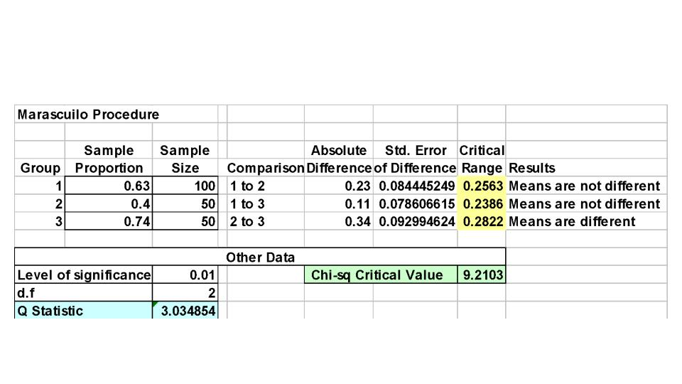

```{r setup, include=FALSE}
library(tufte)
require(dplyr)
require(tidyr)
require(ggplot2)
require(ggthemes)
require(knitr)
require(tibble)

# invalidate cache when the tufte version changes
knitr::opts_chunk$set(tidy = FALSE, cache.extra = packageVersion('tufte'))
options(htmltools.dir.version = FALSE)
```


## Learning Objectives  

In this chapter you will learn:  

* How and when to use chi-square test for contingency tables   
* How to use Marascuilo procedure for determining pair-wise differences when evaluationg more than two proproportions   
* How and when to use non-parametric tests  

## Contingency Tables   

* Useful in situations comparing multiple population proportions   
* Used to classify sample observations according to two or more characteristics   
* Also called cross-classification table (cross-tab)   

## Contingency Table Example   

Suppose you think that there might be a relationship (dependency) between right/left handedness and gender.  
Dominant Hand: Right vs. Left 
Gender: Male vs. Female  
Since there are two categories for each variable, this is called a 2x2 table.  
We sample 300 Children and note their gender and dominant hand.
```{r, message=FALSE, warning=FALSE, echo=FALSE}

dt <- tibble(Gender= c("Female", "Male", "Total"), Left=c(12,24,36), Right=c(108,156,264), Total=c(120,180,300))

kable(dt, caption = "Sample Results organized in contingency table")

```

## $\chi^2$ Test For Difference Between 2 Proportions  

$H_0:\pi_1 = \pi_2$ (Proportion of females whare are left handed is equal to proportion of males who are left handed)  

$H_0:\pi_1 \ne \pi_2$  (The two proportions are not the same)  
If $H_0$ is true, then the proportion of left handed females should be the same as the proportion of left handed males.  The conclusion is that gender has no effect on handedness (i.e. handedness is independent of gender).  

## The Chi-square Test Statistic  

The statistic is:
\begin{equation}
\chi^2_{STAT} = \sum_{all\ cells} \frac{(f_o - f_e)^2}{f_e}
\end{equation}
Where:  
$f_o$ is the observed frequency of each cell    
$f_e$ is the expected frequency of each cell ir $H_0$ is true    
(Assume: each cell has an expected frequency of at least 5)  

## Decision Rule   
The $\chi_{STAT}^2$ test statistic approximately follows a  chi-squared distribution with (rows -1) time (columns -1) degrees of freedom.   
Decision Rule:  
If $\chi_{STAT}^2 > \chi_\alpha^2$ reject $H_0$.   

## Computing the Overall Proportion   
This overall proportion is:  
\begin{equation}
\bar p = \frac{x_1 + ... + x_k}{n_1 + ... + n_k}
\end{equation}
Where:  
$k$ is the number of columns   
$x_1$ is number of items of interest from the first group  
$x_k$ is number of items of interest from the $k^{th}$ group   
$n_1$ is number of items in the first group  
$n_k$ is number of items in the $k^{th}$ group   

For this example:  

$\bar p = \frac{12+ 24}{180 + 120} = \frac{36}{300} = .12$  
## Finding Expected Frequencies   

To obtain the expected frequency for left handed females, multiply the number of females by the overall proportion $\bar p$ of left handers; To obtain the expected frequency for left handed males, multiply the number of males by the overall proportion $\bar p$ of left handers.


If the two proportions are equal, then:  
$P(Left\ Handers | Female) = P(Left\ Handers | Male) = .12$ (i.e. we would expect (.12)(120) = 14.4 females to be left handed and (.12)(180) = 21.6 males to be left handed)  
```{r, message=FALSE, warning=FALSE, echo=FALSE}

dt <- tibble(Gender= c("Female", "Male", "Total"), Left=c("O=12, E=14.4","O=24, E=21.6",36), Right=c("O=108, E=105.6","O=156, E=158.4",264), Total=c(120,180,300))

kable(dt, caption = "Observed vs. Expected Table")

```

Following the 6 step hypothesis process we have:  

1.  $H_0: \pi_1 = \pi_2$     
$H_1: \pi_1 \ne  \pi_2$  where
    $pi_1$ is right handed females, and   
    $pi_2$ is right handed males   
2. $\alpha=.05$
  $n=300$  
3. $\chi^2$ Test and and sampling distribution   
4. Critical value is 3.841 (from $\chi_2$ table with d.f=1 (rows-1)(columns-1))  
4. Determine test statistic:  
  $\chi^2_{STAT} = \sum_{all\ cells} \frac{(f_o - f_e)^2}{f_e}$   
  $\chi^2_{STAT} = \frac{(12-14.4)_2}{14.4} +\frac{(108-105.6)_2}{105.6} +\frac{(24-21.6)_2}{21.6}+\frac{(156-158.4)_2}{158.4}= 0.7576$  
5. Decision Rule: If $\chi^2_{STAT}$ > Critical Value, reject $H_0$, thus   
  since 0.7576 is not greater than 3.841 **do not** reject $H_0$.    
  Since we do not reject $H_0$ there is sufficient evidence that the two proportions are different at$\alpha=.05$.  
    


## The Marascuilo Procedure for $\chi^2$

- Used when the null hypothesis of equal proportions is rejected  
- Enables you to make comparisons between all pairs
- Start with the observed differences, $p_j  – p_{j’}$, for all pairs (for $j \ne j^’$) then compare the absolute difference to a calculated critical range  
Critical Range for the Marascuilo Procedure:  

- Critical Range = $\sqrt{\chi^2}\sqrt{\frac{p_j(1-p_j)}{{n_j}}+\frac{p_{{j’}}(1-p_{{j’}})}{{n_{{j’}}}}}$


(Note:  the critical range is different for each pairwise comparison)
A particular pair of proportions is significantly different if:  


$| p_j  – p_{{j’}}|$  >  critical range for j and j’

## Marascuilo Procedure Example
A University is thinking of switching to a trimester academic calendar. A random sample of 100 administrators, 50 students, and 50 faculty members were surveyed:

```{r, echo=FALSE}

a <- tibble(c("Favor", "Opposed", "Total"))
b <- tibble(c("63","37","100"))
c <- tibble(c("20", "30","50"))
d <- tibble(c("37","13", "50"))
e <- tibble(c(120, 80, 200))
f<- bind_cols(a,b,c,d,e)
kable(f, col.names = c("Opinion", "Administrators", "Students", "Faculty", "Total"))
```


Using a 1% level of significance, which groups have a  different attitude?

## Chi-Square Test Results

$H_0: \pi_1 = \pi_2 = \pi_3$
$H_1$: Not all of the πj are equal (j = 1, 2, 3)

```{r, echo=FALSE}

a <- tibble(c("Favor", "Opposed", "Total"))
b <- tibble(c("0=63,e=60","o=37,e=40","100"))
c <- tibble(c("o=20,e=30", "o=30, e=20", "50"))
d <- tibble(c("o=37, e=30","o=13, e=20", "50"))
e <- tibble(c(120, 80, 200))
f<- bind_cols(a,b,c,d,e)
kable(f, col.names = c("Opinion", "Administrators", "Students", "Faculty", "Total"))
```


$\chi^2_{STAT} = \sum_{All\ cells}\frac{(f_o-f_e)^2}{f_e} =12.792$


## Marascuilo Procedure: Solution



